# Response

## Responsive drawing in Processing 

Code that responds to input from the mouse, keyboard, and other devices has to run continuously. To make this happen, place the lines that update inside de **draw()** function. The code within the **draw()** block runs from top to botoom, then repeats until you quit the program. 

1. ### Example: The draw() Function

To see how **draw()** works, run this example:

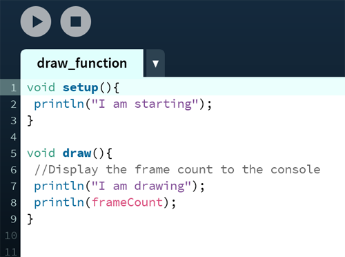

When the code is run, the following is written to the console.

I'm drawing 
1 
I'm drawing 
2 
I'm drawing 
3 
... 

2. ### The setup() Function

To complement the looping **draw()** function, Processing has a function called **setup()** that runs just once when the program starts.

3. ### Follow
    * Track the Mouse 
    
    The mouseX variable stores the x coordinate, and the mouseY variable stores the y coordinate.  
    
    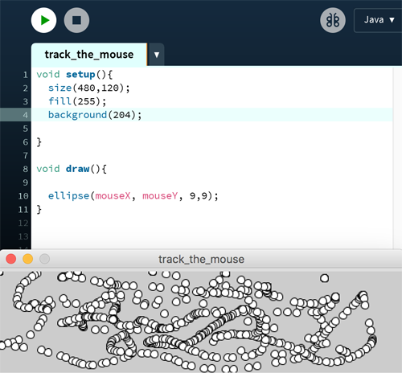  
    
    Place the **background()** function to the begining of **draw()** before the shape is drawn. 

      
    
    * Draw continuously 
    
    The **pmouseX** and **pmouseY** variables store the position of the mouse at the previous frame. When combined with **mouseX** and **mouseY** variables, they can be used to draw continuous lines.
    
     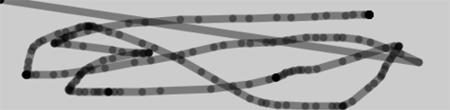  
     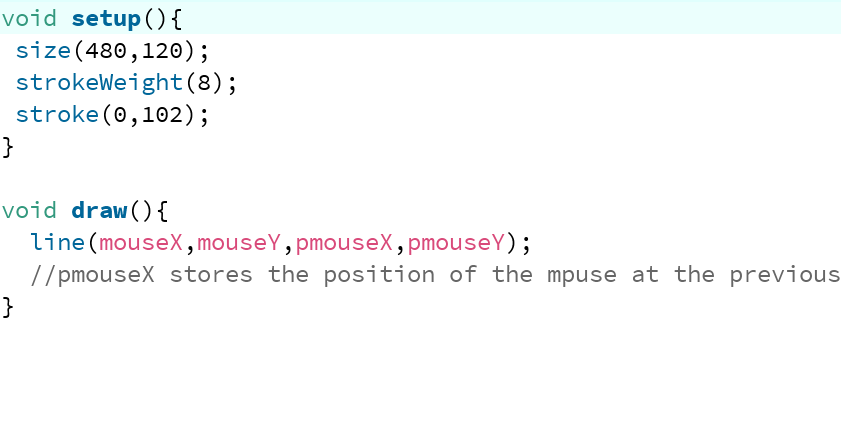  
    * Set Line Thikness 
    
    The **pmouseX** and **pmouseY** variables can also be used to calculate the speed of the mouse. This is done by measuring the distance between the current and most recent mouse location. If the mouse is moving slowly, the distance is small but if the mouse starts moving faster, the distance grows. A function called **dist()** simplifies this calculation. 
    Here, the speed of the mouse is used to set the thikness of the drawn line.
     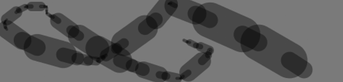  
     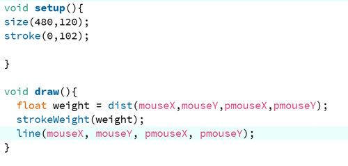  
    
    * Easing Does it
    Easing allows the values asigned to follow the mouse loosely- to lag behind to create a more fluid motion. With easing there are two values: The current value and the value to move toward.  
     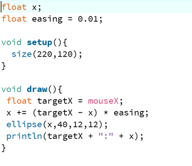  
     
     The value of the x variable is always getting closer to target x. The speed at wich it catches up with target x is set with easing variable. A small value causes more of a delay than a larger value. With an easing value of 1 there os no delay.
     
     
4. ### Click 

    * Click the Mouse
    
    In adition to the location of the mouse, Processing also keeps track of weather the mouse button is pressed. The 
    **mousePressed** variable has a different value when the mouse button is pressed and when it is not. The **mousePressed** variable is a data type called boolean, which means that it has only two different values **true** and **false**. The **mousePressed** variable is used with the if statement to determine when a line of code will run and when it won't. You can extend an if block with an else block, allowing your program to choose between two options. Try this example:
    
      
    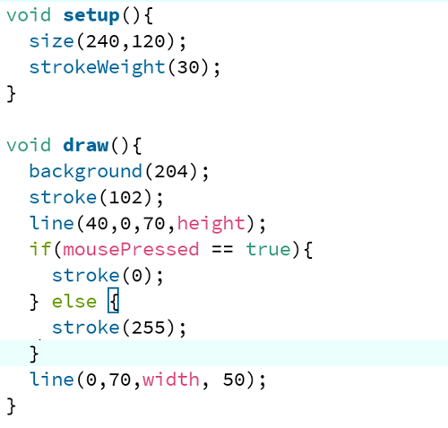  
    
    * Multiple Mouse Buttons
    
    Processing also tracks which button is pressed if you have more than one button on your mouse. The **mouseButton** variable can be one of three values: **LEFT**, **CENTER** or **RIGHT**. To test which button was pressed, the == operator is needed, as shown here.
    
    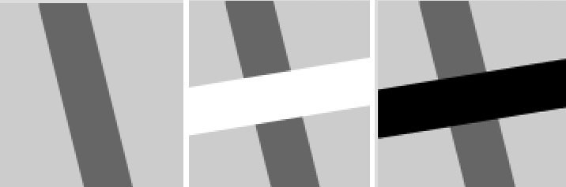  
    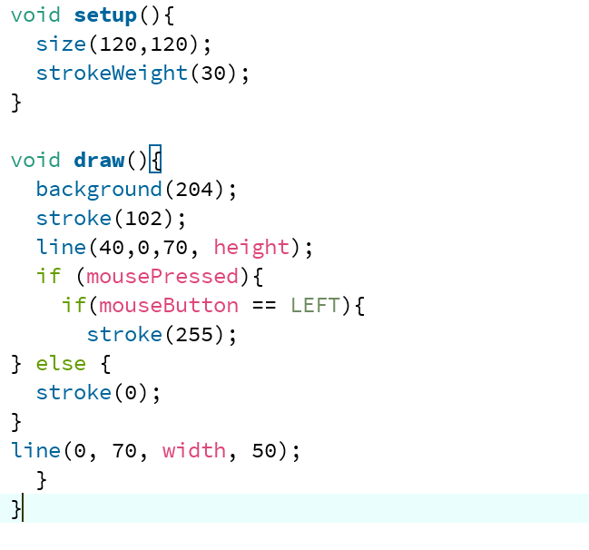  

5. ### Type

    Processing keeps track of when any key on a keyboard is pressed, as well as the last key pressed. Like the **mousePressed** variable, the **keyPressed** variable is true when any key is pressed, and **false** when no keys are pressed.
    
    * Tap a Key
    In this example the second line is drawn only when a key is pressed.
    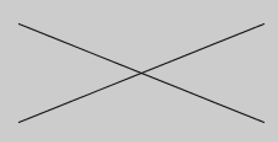  
    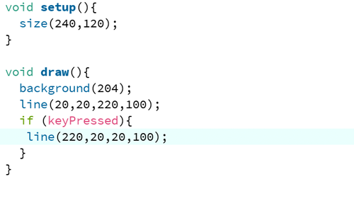  
    The key variable stores the most recen key that has been pressed. The data type for key is char, which is short for character. A char variable can store any single character, which include letters of the alphapet, numbers and symbols. Unlike a **string** value, the character data type is specified by single quotes. This is how a char variable is declared and assigned:
    char c = 'A' //Declare and assigns 'A' to the variable c
    
    * Draw some letters
    
    This example introduces the **textSize()** function to set the size of the letters, the **textAligne()** function to center the text on its x coordinate, and the **text()** function to draw the letter. 
    
    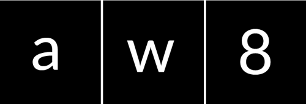  
    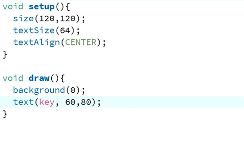  
    
    * Check for Especific Keys 
    
    In this example, we test for an H or N to be typed. We use the comparison operator, the == symbol, to see if the key value is equal to the characters we're looking for:
    
    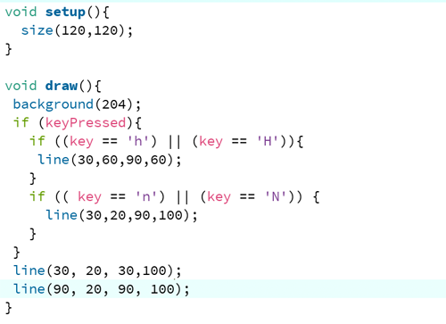  
    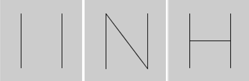  
    
    When we watch for H or N to be pressed, we need to check for both the lowercase and the uppercase letters in the event that someone hits the Shift key or has the Caps Lock set. We combine the two tests toguether with a logical OR, the || symbol. Unlike with the logical AND (the && symbol), only one of these expressions need to be true for the entire test to be true.  
    
    * Move with arrow keys
    
    The following example shows how to check for the left or right arrow keys to move a rectangle:
    
      
    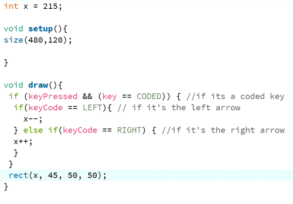  
      
    
        BOOK:
       [Make](https://processing.org/books/) 
       Getting started with Processing  
       A Hands-On Introduction to making Interactive Graphics  
       Casey Reas & Ben Fry  
        
      
